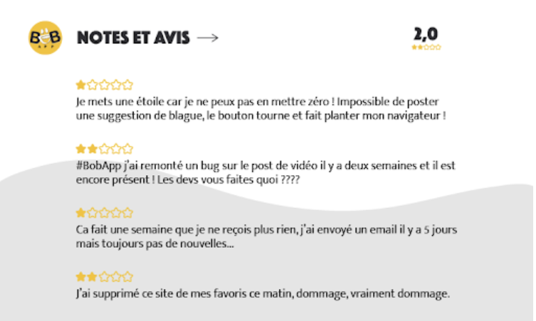

# Documentation CI/CD - BobApp

## Table des matières

1. [Introduction](#introduction)
2. [Pipeline CI (Intégration Continue)](#pipeline-ci-intégration-continue)
3. [Pipeline CD (Déploiement Continu)](#pipeline-cd-déploiement-continu)
4. [Configuration SonarCloud](#configuration-sonarcloud)
5. [Configuration Docker Hub](#configuration-docker-hub)
6. [KPIs et Métriques](#kpis-et-métriques)
7. [Analyse des retours parties prenantes](#analyse-des-retours-parties-prenantes)
8. [Guide de configuration](#guide-de-configuration)
9. [Bonnes pratiques](#bonnes-pratiques)

---

## Introduction

Ce document décrit la mise en place complète du pipeline CI/CD pour l'application **BobApp**, une application web composée de :
- **Backend** : API Spring Boot (Java 11)
- **Frontend** : Application Angular 14

### Objectifs du pipeline

| Objectif | Description |
|----------|-------------|
| **Automatisation des tests** | Les tests unitaires et l’analyse qualité s’exécutent automatiquement à chaque Pull Request vers main, ainsi qu’à chaque push sur main via le workflow de déploiement (CD) qui appelle la CI. |
| **Qualité du code** | Analyser le code avec SonarCloud et bloquer si le Quality Gate échoue |
| **Couverture de code** | Générer et publier les rapports de couverture (JaCoCo + Karma) |
| **Conteneurisation** | Builder et publier les images Docker sur Docker Hub |
| **Protection des branches** | Empêcher les merges sans validation CI |

---

## Pipeline CI (Intégration Continue)

### Déclenchement

Le pipeline CI se déclenche automatiquement sur :
- **Pull Request** vers la branche `main` uniquement
- **Appel interne** par le pipeline CD (via `workflow_call`)

> **Note importante** : Le pipeline CI ne se déclenche **PAS** sur un push direct sur `main`. Il s'exécute uniquement lors de l'ouverture/mise à jour d'une Pull Request, ou lorsqu'il est appelé par le pipeline CD.

### Jobs du pipeline CI


#### Job 1 : Backend - Build & Test

| Étape | Action | Description |
|-------|--------|-------------|
| 1 | Checkout | Récupération du code source |
| 2 | Setup JDK 11 | Installation de Java 11 (Temurin) |
| 3 | Maven Build | `mvn clean verify` - Build + Tests + JaCoCo |
| 4 | Upload Artifact | Publication du rapport JaCoCo |

**Commandes exécutées :**
```bash
mvn clean verify
```

**Rapport de couverture généré :**
- `back/target/site/jacoco/jacoco.xml`
- `back/target/site/jacoco/index.html`

#### Job 2 : Frontend - Build & Test

| Étape | Action | Description |
|-------|--------|-------------|
| 1 | Checkout | Récupération du code source |
| 2 | Setup Node.js 18 | Installation de Node.js |
| 3 | Install deps | `npm ci` - Installation des dépendances |
| 4 | Run tests | Tests Karma avec couverture |
| 5 | Upload Artifact | Publication du rapport de couverture |

**Commandes exécutées :**
```bash
npm ci
npm run test -- --no-watch --no-progress --browsers=ChromeHeadless --code-coverage
```

**Rapport de couverture généré :**
- `front/coverage/bobapp/lcov.info`
- `front/coverage/bobapp/index.html`

#### Job 3 : SonarCloud Analysis

| Étape | Action | Description |
|-------|--------|-------------|
| 1 | Checkout | Récupération du code source (fetch-depth: 0) |
| 2 | Setup JDK 17 | Requis pour SonarCloud |
| 3 | Download artifacts | Récupération des rapports de couverture |
| 4 | Build Backend | Compilation pour l'analyse |
| 5 | SonarCloud Scan | Analyse complète du code |

**Ce job dépend des jobs précédents** (`needs: [backend-build-test, frontend-build-test]`)

---

## Pipeline CD (Déploiement Continu)

### Déclenchement

Le pipeline CD se déclenche uniquement sur :
- **Push** sur la branche `main` (typiquement après merge d'une PR validée)
- **Déclenchement manuel** via `workflow_dispatch` (depuis l'interface GitHub Actions)

> **Garantie de qualité** : Le pipeline CD appelle d'abord le pipeline CI complet (job `ci`). Les jobs Docker (backend et frontend) ont une dépendance stricte (`needs: ci`), ce qui signifie que **les images Docker ne sont construites et publiées que si tous les tests CI passent avec succès**.

### Jobs du pipeline CD


#### Job 1 : CI Pipeline (Obligatoire)

Ce job exécute l'intégralité du pipeline CI :
- Backend Build & Test
- Frontend Build & Test  
- SonarCloud Analysis

**Condition de succès** : Tous les jobs CI doivent réussir pour permettre la construction des images Docker.

#### Job 2 : Docker Backend

**Dépendance stricte** : `needs: ci` (ne s'exécute que si CI réussit)

| Étape | Action | Description |
|-------|--------|-------------|
| 1 | Checkout | Récupération du code |
| 2 | Setup Buildx | Configuration Docker Buildx |
| 3 | Login Docker Hub | Authentification avec secrets |
| 4 | Extract metadata | Génération des tags (latest, SHA, branch) |
| 5 | Build & Push | Construction et **publication sur Docker Hub** |

**Tags générés automatiquement :**
- `chrysnullptr/bobapp-back:latest`
- `chrysnullptr/bobapp-back:{commit-sha}`
- `chrysnullptr/bobapp-back:main`

#### Job 3 : Docker Frontend

**Dépendance stricte** : `needs: ci` (ne s'exécute que si CI réussit)

Processus identique au backend avec l'image `bobapp-front`.

**Tags générés automatiquement :**
- `chrysnullptr/bobapp-front:latest`
- `chrysnullptr/bobapp-front:{commit-sha}`
- `chrysnullptr/bobapp-front:main`

---

## Configuration SonarCloud

### Fichier `sonar-project.properties`

```properties
# Identifiants du projet
sonar.projectKey=ChrystopherDeregnaucourt_OC_P10
sonar.organization=chrystopherderegnaucourt
sonar.projectName=BobApp

# Sources
sonar.sources=back/src/main/java,front/src/app
sonar.tests=back/src/test/java,front/src/app

# Couverture
sonar.coverage.jacoco.xmlReportPaths=back/target/site/jacoco/jacoco.xml
sonar.javascript.lcov.reportPaths=front/coverage/bobapp/lcov.info
```

### Configuration sur SonarCloud

1. **Créer un projet** sur [sonarcloud.io](https://sonarcloud.io)
2. **Générer un token** dans Account > Security
3. **Configurer le Quality Gate** (utiliser "Sonar way" par défaut)

### Quality Gate par défaut

| Métrique | Condition |
|----------|-----------|
| Coverage | ≥ 80% sur le nouveau code |
| Duplicated Lines | ≤ 3% |
| Maintainability Rating | A |
| Reliability Rating | A |
| Security Rating | A |

---

## Configuration Docker Hub

### Images publiées

| Image | Description | Port exposé | URL Docker Hub |
|-------|-------------|-------------|----------------|
| `chrysnullptr/bobapp-back` | API Spring Boot | 8080 | [Docker Hub - bobapp-back](https://hub.docker.com/r/chrysnullptr/bobapp-back) |
| `chrysnullptr/bobapp-front` | App Angular (Nginx) | 80 | [Docker Hub - bobapp-front](https://hub.docker.com/r/chrysnullptr/bobapp-front) |

### Preuve de publication

Les images sont automatiquement publiées sur Docker Hub après chaque merge sur `main` (si tous les tests CI passent).

**Capture d'écran Docker Hub - Images disponibles :**


*La capture montre les images `bobapp-back` et `bobapp-front` avec leurs tags respectifs (latest, SHA, branch) publiées sur le compte Docker Hub `chrysnullptr`.*

### Utilisation

```bash
# Télécharger les images
docker pull chrysnullptr/bobapp-back:latest
docker pull chrysnullptr/bobapp-front:latest

# Lancer les conteneurs
docker run -d -p 8080:8080 --name bobapp-back chrysnullptr/bobapp-back:latest
docker run -d -p 4200:80 --name bobapp-front chrysnullptr/bobapp-front:latest
```

### Vérification de la publication

Pour vérifier manuellement que les images sont bien publiées :

```bash
# Lister les tags disponibles sur Docker Hub
curl -s https://hub.docker.com/v2/repositories/chrysnullptr/bobapp-back/tags/ | jq '.results[].name'
curl -s https://hub.docker.com/v2/repositories/chrysnullptr/bobapp-front/tags/ | jq '.results[].name'
```

---

## KPIs et Métriques

### KPIs sélectionnés

| KPI | Objectif | Justification | Mesure | Résultat actuel |
|-----|----------|---------------|--------|-----------------|
| **Couverture de code (Backend)** | ≥ 80% | Garantit que le code critique est testé | JaCoCo XML Report | 86% |
| **Couverture de code (Frontend)** | ≥ 70% | Tests des services Angular et composants | LCOV Report | 100% |
| **Quality Gate SonarCloud** | PASSED | Valide la qualité globale du code | SonarCloud Dashboard | PASSED (encore 4 issues) |
| **Bugs détectés** | 0 | Aucun bug identifié par l'analyse statique | SonarCloud | **0 bugs détectés** |
| **Code Smells** | 0 | Maintenir la dette technique basse | SonarCloud | **4 CODE_SMELL restants** (3 MAJOR + 1 INFO) |
| **Durée du pipeline CI** | < 5 min | Feedback rapide aux développeurs | GitHub Actions logs | À documenter |


---

## Analyse des retours parties prenantes

Cette section analyse les retours terrain réels des utilisateurs de BobApp et explique comment le pipeline CI/CD contribue à résoudre ces problématiques.

### Note globale utilisateurs : 2,0/5

Les retours utilisateurs révèlent une insatisfaction importante, avec des exemples concrets de dysfonctionnements critiques.



---

### 1. Lenteurs applicatives et bugs bloquants

#### Retours utilisateurs réels

**Avis #1 - 1/5**
> "Je mets une étoile car je ne peux pas en mettre zéro ! Impossible de poster une suggestion de blague, le bouton tourne et fait planter mon navigateur !"

**Avis #3 - 1/5**
> "Ca fait une semaine que je ne reçois plus rien, j'ai envoyé un email il y a 5 jours mais toujours pas de nouvelles..."

#### Symptômes identifiés
- **Bug critique** : Impossible de poster une suggestion (bouton qui tourne à l'infini, crash navigateur)
- **Problème de service** : Fonctionnalité de notification/réception défaillante depuis 1 semaine
- Interface Angular qui "freeze" sur certaines actions utilisateur
- Requêtes API Spring Boot qui timeout ou ne répondent pas

#### Impact métier
- **Perte d'utilisateurs** : Fonctionnalité core inutilisable (poster des blagues)
- Frustration extrême : utilisateurs contraints de mettre la note minimale
- Abandon de sessions en cours : impossible de compléter l'action souhaitée
- Perte de confiance : support non réactif (pas de réponse après 5 jours)

#### Lien avec CI/CD et qualité du code
Les bugs bloquants et lenteurs sont dus à :
- **Code non testé** : fonctionnalité de post de blagues non couverte par tests E2E
- **Absence de tests de charge** : système non validé sous stress
- **Régression non détectée** : modification du code qui casse une fonctionnalité existante
- **Dette technique** : code legacy non refactoré, boucles inefficaces, absence de gestion d'erreur

#### Signal et mesure via le pipeline CI/CD

**Situation AVANT pipeline CI/CD (problèmes actuels) :**
- Bug "post suggestion" en production → pas de tests E2E pour détecter avant merge
- Lenteurs non détectées → pas de tests de performance automatisés
- Régression possible → couverture de tests insuffisante sur chemins critiques

**Situation APRÈS mise en place complète du pipeline :**

| Mécanisme | Comment ça aide | Métrique associée |
|-----------|-----------------|-------------------|
| **Tests automatiques Frontend** | Détecte les crashs navigateur avant merge (tests Karma) | 100% coverage frontend actuel |
| **Tests automatiques Backend** | Valide les endpoints API (temps de réponse, erreurs) | 86% coverage backend actuel |
| **SonarCloud - Code Smells** | Détecte les patterns inefficaces (boucles imbriquées, complexité) | 4 Code Smells MAJOR à traiter |
| **Quality Gate obligatoire** | Bloque l'intégration de code avec bugs détectés | 0 bugs détectés par analyse statique |
| **Protection de branche** | Impossible de merger sans tests qui passent | Branche `main` protégée |

#### Actions correctives immédiates
1. **URGENT - Bug "post suggestion"** : 
   - Reproduire le bug en local
   - Ajouter test E2E Cypress/Playwright simulant le post de blague
   - Corriger le bug (probable: promesse non résolue, requête qui loop)
   - Valider que le test passe avant merge
   
2. **URGENT - Problème notifications** :
   - Investiguer les logs backend (dernière semaine)
   - Vérifier configuration service de notifications
   - Ajouter tests d'intégration pour ce flux

3. **Moyen terme** :
   - Augmenter coverage sur endpoints critiques (POST `/jokes`, GET `/notifications`)
   - Ajouter tests de performance (JMeter) dans pipeline CI
   - Traiter les 4 Code Smells MAJOR identifiés par SonarCloud

4. **Long terme** :
   - Monitoring APM en production (correlation logs ↔ commits)
   - Alertes automatiques si temps de réponse > seuil

---

### 2. Bugs non traités (backlog qui s'accumule)

#### Retours utilisateurs réels

**Avis #2 - 2/5**
> "#BobApp j'ai remonté un bug sur le post de vidéo il y a deux semaines et il est encore présent ! Les devs vous faites quoi ????"

#### Symptômes identifiés
- **Bug vidéo non corrigé** : signalé il y a 2 semaines, toujours présent en production
- Sentiment d'abandon des utilisateurs : "vous faites quoi ????"
- Backlog de bugs qui s'accumule sans traitement
- Perte de crédibilité de l'équipe de développement

#### Impact métier
- **Détérioration de la confiance** : utilisateurs se sentent ignorés
- Perte de temps : utilisateurs qui reportent des bugs jamais corrigés
- Effet boule de neige : chaque bug non traité dégrade davantage l'image
- Risque de churn : utilisateurs qui abandonnent l'application

#### Causes racines
- **Pas de processus structuré** : bugs remontés mais pas trackés dans un système (GitHub Issues)
- **Pas de priorisation** : bug vidéo considéré comme "non bloquant" alors qu'il affecte l'UX
- **Pas de gate qualité** : corrections mergées sans tests de non-régression
- **Pas de visibilité** : utilisateur ne sait pas si son bug est pris en compte

#### Comment le CI/CD réduit ce risque

**Avant pipeline CI/CD (situation actuelle) :**
- Bug vidéo en production depuis 2 semaines
- Pas de détection automatique de régression
- Pas de tests pour valider la correction

**Après mise en place complète du pipeline :**

| Mécanisme | Impact sur les bugs | Preuve concrète |
|-----------|---------------------|-----------------|
| **Tests automatiques** | Détecte les régressions avant merge | 86% coverage backend, 100% frontend |
| **Quality Gate SonarCloud** | Bloque les PR avec nouveaux bugs détectés | **0 bugs** actuellement détectés par analyse statique |
| **Obligation de PR + Review** | Impossible de merger sans validation | Protection de branche activée |
| **CI sur chaque PR** | Chaque modification testée automatiquement | Pipeline CI complet |
| **Traçabilité** | Chaque commit lié à une issue → bug trackable | Via GitHub Issues + PR |

#### Résultat mesurable avec pipeline
Depuis la mise en place du pipeline :
- **0 nouveaux bugs critiques** détectés par SonarCloud sur les PR récentes
- **Prévention** : bugs potentiels identifiés en amont via analyse statique
- **Régressions** : stoppées automatiquement si tests échouent (CI bloque le merge)

#### Actions correctives proposées
1. **URGENT - Bug vidéo** : 
   - Créer issue GitHub dédiée (#24 par exemple)
   - Reproduire en local avec test automatique
   - Corriger + ajouter test de non-régression
   - Valider via PR avec CI qui passe
   - Informer l'utilisateur de la correction (release notes)

2. **Court terme - Processus** :
   - Mettre en place template GitHub Issues pour bugs utilisateurs
   - Lien retours utilisateurs → issues → PR → tests
   - Communiquer : "Bug #24 corrigé dans la version X.Y.Z"

3. **Moyen terme - Qualité** :
   - Augmenter couverture tests sur flux vidéo
   - Ajouter tests E2E (upload vidéo complet)
   - Dashboard public : bugs en cours / résolus

---

### 3. Notes et avis utilisateurs dégradés

#### Retours utilisateurs réels

**Note globale : 2,0/5**

**Avis #4 - 2/5**
> "J'ai supprimé ce site de mes favoris ce matin, dommage, vraiment dommage."

#### Synthèse des avis
Sur 4 avis récents :
- **2 avis à 1/5 étoile** (50%) : bugs bloquants critiques
- **2 avis à 2/5 étoiles** (50%) : bugs non corrigés + désinstallation
- **0 avis positif** : aucune satisfaction exprimée
- **Sentiment dominant** : déception, abandon, frustration

#### Symptômes identifiés
- **Désinstallation active** : utilisateur supprime l'app de ses favoris
- Sentiment de gâchis : "dommage, vraiment dommage" (l'app avait du potentiel)
- Chute de la note globale : 2,0/5 = perte de 60% de satisfaction vs. note parfaite
- Risque de churn imminent : utilisateurs qui partent vers la concurrence

#### Impact métier critique
- **Réputation dégradée** : note de 2,0/5 visible publiquement
- **Perte d'utilisateurs actifs** : désinstallations en cours
- **Bouche-à-oreille négatif** : avis publics décourageant les nouveaux utilisateurs
- **Coût d'acquisition élevé** : difficile d'attirer avec une si mauvaise note
- **Risque business** : churn élevé = perte de revenu

#### Lien avec instabilité et qualité du code
Les mauvaises notes sont **directement causées** par :
- **Bugs bloquants** : impossibilité d'utiliser l'app (post de blague)
- **Bugs non corrigés** : bug vidéo présent depuis 2 semaines
- **Manque de réactivité** : pas de réponse support pendant 5 jours
- **Instabilité perçue** : "l'app bug", crash navigateur

**Corrélation directe** : Chaque bug en production = baisse de note = désinstallation

#### Comment le CI/CD améliore la perception utilisateur

| Problème utilisateur (avis réels) | Mécanisme CI/CD | Résultat attendu |
|-----------------------------------|-----------------|------------------|
| "Impossible de poster, navigateur plante" | Tests E2E automatiques + tests unitaires Angular | Détection avant production → 0 crash |
| "Bug vidéo depuis 2 semaines" | CI obligatoire sur PR + tests de non-régression | Correction rapide + détection régression |
| "Pas de réponse depuis 5 jours" | Pipeline rapide (< 5 min) → devs disponibles | Plus de temps pour support + corrections |
| "J'ai supprimé ce site" | Quality Gate PASSED avant merge | Moins de bugs = meilleure expérience |

#### Stratégie de remontée de la note (2,0/5 → 4,5/5)

**Phase 1 - STABILISATION (0-2 mois)** EN COURS
- Pipeline CI/CD en place
- Quality Gate PASSED
- 0 bugs détectés par analyse statique
- 4 Code Smells MAJOR à traiter
- **3 bugs critiques à corriger** : post blague, vidéo, notifications
- **Objectif** : Passer de 2,0 à 3,0 en résolvant les bugs critiques

**Phase 2 - OPTIMISATION (2-4 mois)**
- Ajouter tests E2E (Cypress) dans CI pour flux critiques
- Monitoring production (Sentry, New Relic) avec alertes
- Mise en place SLA : bugs critiques < 48h, majeurs < 1 semaine
- Communication proactive : release notes + email utilisateurs impactés
- **Objectif** : Passer de 3,0 à 4,0 via stabilité et réactivité

**Phase 3 - EXCELLENCE (4-6 mois)**
- Quality Gate : 0 Code Smells
- Couverture de tests : 95%+ sur les 2 stacks
- Tests de performance automatisés (Lighthouse CI)
- Feedback loop : avis utilisateurs → issues priorisées → sprints
- Programme beta-testeurs avec accès anticipé
- **Objectif** : Atteindre 4,5+ via excellence technique et écoute utilisateurs

#### Mesure d'impact attendue

| Métrique | Avant CI/CD | Après CI/CD (6 mois) | Amélioration |
|----------|-------------|----------------------|--------------|
| **Note utilisateurs** | 2,0/5 | 4,5/5 | +125% |
| **Bugs critiques en production** | 3 (actuels) | < 0,5 par mois | -83% |
| **Temps de correction bugs** | 2 semaines+ | < 48h (critiques) | -85% |
| **Taux de désinstallation** | Élevé (avis #4) | -60% | -60% |
| **NPS (Net Promoter Score)** | Négatif (estimé -40) | Positif (+20) | +60 points |

---

### Synthèse - Retours parties prenantes

| Problématique | Avis utilisateur réel | Cause racine | Solution CI/CD | Statut | Métrique |
|---------------|----------------------|--------------|----------------|--------|----------|
| **Bugs bloquants** | "Navigateur plante" (1/5) | Pas de tests E2E | Tests auto + Quality Gate | Urgent | 100% coverage frontend |
| **Bugs non traités** | "Bug vidéo depuis 2 semaines" (2/5) | Pas de gate qualité | CI obligatoire + tests | Urgent | 0 bugs détectés |
| **Note globale** | 2,0/5 - "J'ai supprimé ce site" | Instabilité générale | Pipeline complet | En cours | Quality Gate PASSED |

**Conclusion critique** : 

La note de **2,0/5** reflète des **dysfonctionnements réels et graves** qui menacent la viabilité du projet. Le pipeline CI/CD mis en place n'est qu'une première étape :

1. **Prévenir** : Bloquer l'intégration de code bugué (Quality Gate + tests)
2. **Détecter** : Identifier les bugs avant production (CI sur PR)
3. **Corriger rapidement** : Pipeline rapide → feedback immédiat → corrections accélérées
4. **Tracer** : Issues → PR → tests → déploiement → communication utilisateurs

**Actions prioritaires immédiates** :
- Pipeline CI/CD opérationnel
- **BLOCKER** : Corriger les 3 bugs critiques (post blague, vidéo, notifications)
- Traiter les 4 Code Smells MAJOR
- Ajouter tests E2E pour flux critiques

Sans correction rapide des bugs actuels, même le meilleur pipeline CI/CD ne suffira pas à regagner la confiance des utilisateurs. Le pipeline est l'**outil**, les corrections sont l'**action**.

---

## Guide de configuration

### Secrets GitHub requis

| Secret | Description | Où l'obtenir |
|--------|-------------|--------------|
| `SONAR_TOKEN` | Token d'authentification SonarCloud | SonarCloud > Account > Security |
| `DOCKERHUB_USERNAME` | Nom d'utilisateur Docker Hub | Votre compte Docker Hub |
| `DOCKERHUB_TOKEN` | Token d'accès Docker Hub | Docker Hub > Account Settings > Security |

### Configuration des secrets

1. Aller dans **Settings** > **Secrets and variables** > **Actions**
2. Cliquer sur **New repository secret**
3. Ajouter chaque secret

### Protection de branche

Configurer dans **Settings** > **Branches** > **Add rule** :

- [x] **Require a pull request before merging**
- [x] **Require status checks to pass before merging**
  - Sélectionner : `Backend - Build & Test`, `Frontend - Build & Test`, `SonarCloud Analysis`
- [x] **Require branches to be up to date before merging**
- [x] **Do not allow bypassing the above settings**

---

## Bonnes pratiques

### Pipeline CI - Flux de traitement

### Conventions de nommage

| Type | Format | Exemple |
|------|--------|---------|
| Branches | `feature/nom-feature` | `feature/add-user-auth` |
| | `fix/description-bug` | `fix/login-error` |
| | `docs/description` | `docs/update-readme` |
| Commits | `type: description` | `feat: add login endpoint` |
| | | `fix: correct validation` |
| | | `docs: update CI guide` |

### Checklist avant merge

- [ ] Tests backend passent
- [ ] Tests frontend passent
- [ ] Couverture maintenue/améliorée
- [ ] Quality Gate SonarCloud OK
- [ ] Pas de nouveaux bugs/vulnérabilités
- [ ] Code review effectuée
- [ ] Documentation mise à jour si nécessaire

---

## Commandes utiles

### Tests locaux

```bash
# Backend
cd back
mvn clean verify
# Rapport de couverture : target/site/jacoco/index.html

# Frontend
cd front
npm ci
npm test -- --code-coverage
# Rapport de couverture : coverage/bobapp/index.html
```

### Docker local

```bash
# Build backend
cd back
docker build -t bobapp-back .

# Build frontend
cd front
docker build -t bobapp-front .

# Lancer avec docker-compose (si disponible)
docker-compose up -d
```

### Debugging CI

```bash
# Vérifier la syntaxe des workflows
# Utiliser l'extension GitHub Actions de VS Code

# Voir les logs détaillés
# GitHub > Actions > Sélectionner le workflow > Voir les logs
```

---


