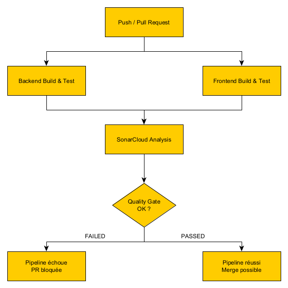
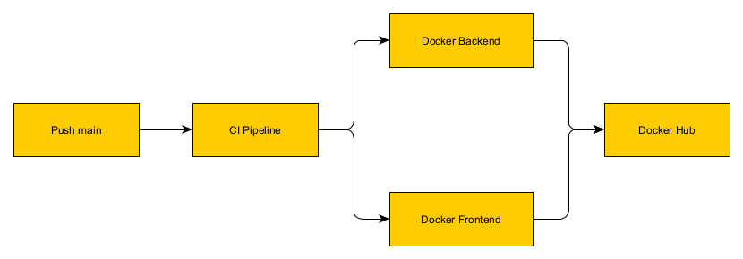

# Documentation CI/CD - BobApp

## Table des matières

1. [Introduction](#introduction)
3. [Pipeline CI (Intégration Continue)](#pipeline-ci-intégration-continue)
4. [Pipeline CD (Déploiement Continu)](#pipeline-cd-déploiement-continu)
5. [Configuration SonarCloud](#configuration-sonarcloud)
6. [Configuration Docker Hub](#configuration-docker-hub)
7. [KPIs et Métriques](#kpis-et-métriques)
8. [Guide de configuration](#guide-de-configuration)
9. [Bonnes pratiques](#bonnes-pratiques)

---

## Introduction

Ce document décrit la mise en place complète du pipeline CI/CD pour l'application **BobApp**, une application web composée de :
- **Backend** : API Spring Boot (Java 11)
- **Frontend** : Application Angular 14

### Objectifs du pipeline

| Objectif | Description |
|----------|-------------|
| **Automatisation des tests** | Exécuter automatiquement les tests unitaires à chaque PR et push |
| **Qualité du code** | Analyser le code avec SonarCloud et bloquer si le Quality Gate échoue |
| **Couverture de code** | Générer et publier les rapports de couverture (JaCoCo + Karma) |
| **Conteneurisation** | Builder et publier les images Docker sur Docker Hub |
| **Protection des branches** | Empêcher les merges sans validation CI |

---

## Pipeline CI (Intégration Continue)

### Déclenchement

Le pipeline CI se déclenche automatiquement sur :
- **Push** sur la branche `main`
- **Pull Request** vers la branche `main`

### Jobs du pipeline CI



#### Job 1 : Backend - Build & Test

| Étape | Action | Description |
|-------|--------|-------------|
| 1 | Checkout | Récupération du code source |
| 2 | Setup JDK 11 | Installation de Java 11 (Temurin) |
| 3 | Maven Build | `mvn clean verify` - Build + Tests + JaCoCo |
| 4 | Upload Artifact | Publication du rapport JaCoCo |

**Commandes exécutées :**
```bash
mvn clean verify
```

**Rapport de couverture généré :**
- `back/target/site/jacoco/jacoco.xml`
- `back/target/site/jacoco/index.html`

#### Job 2 : Frontend - Build & Test

| Étape | Action | Description |
|-------|--------|-------------|
| 1 | Checkout | Récupération du code source |
| 2 | Setup Node.js 18 | Installation de Node.js |
| 3 | Install deps | `npm ci` - Installation des dépendances |
| 4 | Run tests | Tests Karma avec couverture |
| 5 | Upload Artifact | Publication du rapport de couverture |

**Commandes exécutées :**
```bash
npm ci
npm run test -- --no-watch --no-progress --browsers=ChromeHeadless --code-coverage
```

**Rapport de couverture généré :**
- `front/coverage/bobapp/lcov.info`
- `front/coverage/bobapp/index.html`

#### Job 3 : SonarCloud Analysis

| Étape | Action | Description |
|-------|--------|-------------|
| 1 | Checkout | Récupération du code source (fetch-depth: 0) |
| 2 | Setup JDK 17 | Requis pour SonarCloud |
| 3 | Download artifacts | Récupération des rapports de couverture |
| 4 | Build Backend | Compilation pour l'analyse |
| 5 | SonarCloud Scan | Analyse complète du code |

**Ce job dépend des jobs précédents** (`needs: [backend-build-test, frontend-build-test]`)

---

## Pipeline CD (Déploiement Continu)

### Déclenchement

Le pipeline CD se déclenche sur :
- **Push** sur la branche `main` (après merge d'une PR)
- **Manuellement** via `workflow_dispatch`

### Jobs du pipeline CD



#### Job : Docker Backend

| Étape | Action | Description |
|-------|--------|-------------|
| 1 | Checkout | Récupération du code |
| 2 | Setup Buildx | Configuration Docker Buildx |
| 3 | Login Docker Hub | Authentification |
| 4 | Build & Push | Construction et publication de l'image |

**Tags générés :**
- `{username}/bobapp-back:latest`
- `{username}/bobapp-back:{sha}`
- `{username}/bobapp-back:main`

#### Job : Docker Frontend

Même processus que le backend, avec l'image `bobapp-front`.

---

## Configuration SonarCloud

### Fichier `sonar-project.properties`

```properties
# Identifiants du projet
sonar.projectKey=ChrystopherDeregnaucourt_OC_P10
sonar.organization=chrystopherderegnaucourt
sonar.projectName=BobApp

# Sources
sonar.sources=back/src/main/java,front/src/app
sonar.tests=back/src/test/java,front/src/app

# Couverture
sonar.coverage.jacoco.xmlReportPaths=back/target/site/jacoco/jacoco.xml
sonar.javascript.lcov.reportPaths=front/coverage/bobapp/lcov.info
```

### Configuration sur SonarCloud

1. **Créer un projet** sur [sonarcloud.io](https://sonarcloud.io)
2. **Générer un token** dans Account > Security
3. **Configurer le Quality Gate** (utiliser "Sonar way" par défaut)

### Quality Gate par défaut

| Métrique | Condition |
|----------|-----------|
| Coverage | ≥ 80% sur le nouveau code |
| Duplicated Lines | ≤ 3% |
| Maintainability Rating | A |
| Reliability Rating | A |
| Security Rating | A |

---

## Configuration Docker Hub

### Images publiées

| Image | Description | Port exposé |
|-------|-------------|-------------|
| `bobapp-back` | API Spring Boot | 8080 |
| `bobapp-front` | App Angular (Nginx) | 80 |

### Utilisation

```bash
# Télécharger les images
docker pull {username}/bobapp-back:latest
docker pull {username}/bobapp-front:latest

# Lancer les conteneurs
docker run -d -p 8080:8080 {username}/bobapp-back:latest
docker run -d -p 80:80 {username}/bobapp-front:latest
```

---

## KPIs et Métriques

### KPIs sélectionnés

| KPI | Objectif | Justification | Mesure | Résultat actuel |
|-----|----------|---------------|--------|-----------------|
| **Couverture de code (Backend)** | ≥ 80% | Garantit que le code critique est testé | JaCoCo XML Report | 86% |
| **Couverture de code (Frontend)** | ≥ 70% | Tests des services Angular et composants | LCOV Report | 100% |
| **Quality Gate SonarCloud** | PASSED | Valide la qualité globale du code | SonarCloud Dashboard | PASSED (encore 4 issues) |
| **Bugs détectés** | 0 | Aucun bug identifié par l'analyse statique | SonarCloud | **0 bugs détectés** |
| **Code Smells** | 0 | Maintenir la dette technique basse | SonarCloud | **4 CODE_SMELL restants** (3 MAJOR + 1 INFO) |
| **Durée du pipeline CI** | < 5 min | Feedback rapide aux développeurs | GitHub Actions logs | À documenter |


---

## Guide de configuration

### Secrets GitHub requis

| Secret | Description | Où l'obtenir |
|--------|-------------|--------------|
| `SONAR_TOKEN` | Token d'authentification SonarCloud | SonarCloud > Account > Security |
| `DOCKERHUB_USERNAME` | Nom d'utilisateur Docker Hub | Votre compte Docker Hub |
| `DOCKERHUB_TOKEN` | Token d'accès Docker Hub | Docker Hub > Account Settings > Security |

### Configuration des secrets

1. Aller dans **Settings** > **Secrets and variables** > **Actions**
2. Cliquer sur **New repository secret**
3. Ajouter chaque secret

### Protection de branche

Configurer dans **Settings** > **Branches** > **Add rule** :

- [x] **Require a pull request before merging**
- [x] **Require status checks to pass before merging**
  - Sélectionner : `Backend - Build & Test`, `Frontend - Build & Test`, `SonarCloud Analysis`
- [x] **Require branches to be up to date before merging**
- [x] **Do not allow bypassing the above settings**

---

## Bonnes pratiques

### Pipeline CI - Flux de traitement

### Conventions de nommage

| Type | Format | Exemple |
|------|--------|---------|
| Branches | `feature/nom-feature` | `feature/add-user-auth` |
| | `fix/description-bug` | `fix/login-error` |
| | `docs/description` | `docs/update-readme` |
| Commits | `type: description` | `feat: add login endpoint` |
| | | `fix: correct validation` |
| | | `docs: update CI guide` |

### Checklist avant merge

- [ ] Tests backend passent
- [ ] Tests frontend passent
- [ ] Couverture maintenue/améliorée
- [ ] Quality Gate SonarCloud OK
- [ ] Pas de nouveaux bugs/vulnérabilités
- [ ] Code review effectuée
- [ ] Documentation mise à jour si nécessaire

---

## Commandes utiles

### Tests locaux

```bash
# Backend
cd back
mvn clean verify
# Rapport de couverture : target/site/jacoco/index.html

# Frontend
cd front
npm ci
npm test -- --code-coverage
# Rapport de couverture : coverage/bobapp/index.html
```

### Docker local

```bash
# Build backend
cd back
docker build -t bobapp-back .

# Build frontend
cd front
docker build -t bobapp-front .

# Lancer avec docker-compose (si disponible)
docker-compose up -d
```

### Debugging CI

```bash
# Vérifier la syntaxe des workflows
# Utiliser l'extension GitHub Actions de VS Code

# Voir les logs détaillés
# GitHub > Actions > Sélectionner le workflow > Voir les logs
```

---


